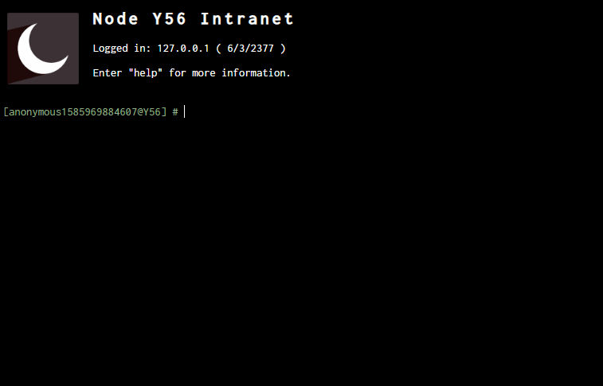
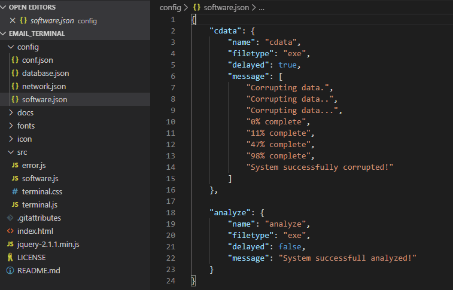
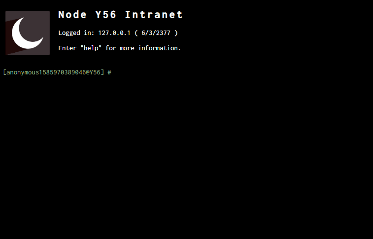
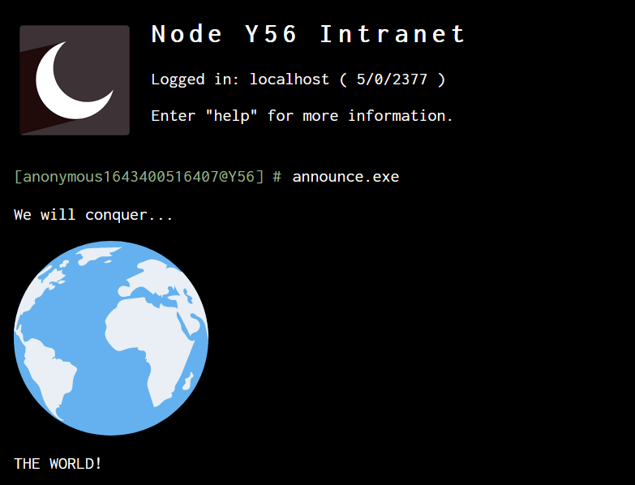
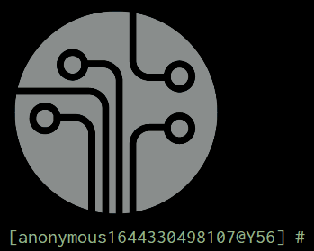
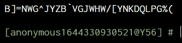

# Email Reader Terminal for tabletop RPGs


This is a simple, read-only, terminal experience for tabletop RPGs.
You can fork the project and change the code for your own configurations, like terminal name (or sector/station/node if sci-fi), image and messages.

The database is a simple set of JSON files.

You can host it on Github Pages for a free and fast experience and can share the link for your friends and players to use.

<!-- To update this Table Of Contents:
    markdown-toc -i README.md
-->

<!-- toc -->

- [Latest News](#latest-news)
- [Quick launch](#quick-launch)
- [How to Configure](#how-to-configure)
- [Customization](#customization)
  * [manifest.json](#manifestjson)
  * [userlist.json](#userlistjson)
  * [mailserver.json](#mailserverjson)
  * [Software](#software)
  * [Login, Mail & Read Functions](#login-mail--read-functions)
  * [History](#history)
  * [Other Functions](#other-functions)
- [How to Install](#how-to-install)
- [Future of the Project](#future-of-the-project)
- [Customization / what to do with this](#customization--what-to-do-with-this)
- [Acknowledgement](#acknowledgement)
  * [Icons Acknowledgement](#icons-acknowledgement)
  * [Icons Acknowledgement (not included)](#icons-acknowledgement-not-included)

<!-- tocstop -->

## Latest News

You can now configure and access extra servers at `network.json` to login via `ssh`.
Each server will treat their respective users (and mail messages) separately.

---


You can now configure custom software at `software.json` to use it.
They're just simple simulations, but I hope you enjoy it!

---


The `help` command has been improved.
You can now show further help instructions for internal commands.

---


## Quick launch

The following command will launch a HTTP server serving the project files:

```node
npm start
```

## How to Configure

You can upload it to Github Pages or try it on your computer. 
You will find instructions for both options below.

## Customization

You will want to customize the terminal depending on the game setting you're playing. You just have to edit the `manifest.json` file.

More configuration files will be added when more functionality shows up.

The main server, which is where the terminal will start, is located as `localhost` at `config/network`.

The `network` folder is where every server available needs to be. This is where you can configure new servers to be accessed via the `ssh` command.

You need to create a folder with the name of the server address if you want to connect to custom servers.

Each server will have a distinct user list, mail messages, and server files.
That is, you can't access data of a user configured on `mailserver.json` while you're at another server.

### manifest.json

The basic configuration at `manifest.json` is what you need to change to customize your terminal.
You can change the terminal year date, the server name, a customized icon, the terminal identification
(this is what is written just before the cursor), as well as the default user id and name (normally this will be "user",
but it can be whatever you want).
Note however that, once you login to the server, the username will change.

```json
{
    "year": "2377",
    "serverAddress": "localhost",
    "serverName": "Node Y56 Intranet",
    "iconName": "Moon-icon.png",
    "terminalID": "Y56",
    "defaultUser": {
        "userId": "user",
        "password": "",
        "userName": "anonymous"
    }
}
```
---


```json
{
    "year": "1972",
    "serverAddress": "127.0.0.1",
    "serverName": "FBI: X-Files Division",
    "iconName": "fbi.png",
    "terminalID": "fbi",
    "defaultUser": {
        "userId": "user",
        "password": "",
        "userName": "anonymous"
    }
}
```
---


### userlist.json

The `userlist.json` file is where you will add your players as users of the main server, or the NPC users of other servers.
The basic structure of the file is as follows:

- userId: is the username identification for login
- password: is the password necessary to login
- userName: this is the name of the player character (if the terminal is where he check his emails) or the name of a npc (if he's hacking into someone else's computer/server)

You can register as many users and mail messages as you want. You just need to put a comma (`,`) right after the correct enclosing `}`. If you're in trouble, you can check a basic JSON tutorial, it's easy.

```json
[
    {
        "userId": "8A73B5",
        "password": "trustno1",
        "userName": "Mulder, Fox"
    },

    {
        "userId": "admin",
        "password": "admin",
        "userName": "root"
    }
]
```

### mailserver.json

This is where you will register the server mails.
You can register as many mail messages as you want by adding a comma (`,`) right after the correct enclosing `}`.
You can register the same email for multiple users at once.

- from: the name of the person who supposedly sent the message
- to: a list of users who will have access to the message after login
- title: the title of the message that will be given when listing mail messages
- body: the actual message to be displayed after selecting it to be read

Note that `user` will display the message for visitors if the `defaultUser` `userId` is registered as `user` in the respective server `manifest.json`.

In the body, you can break the line with a double space.

```json
[
    {
        "from": "admin",
        "to": ["8A73B5", "user"],
        "title": "Maintenance in all servers",
        "body": "This message is for all divisions of the Bureau.  Starting today, the servers may suffer instability due to the latest maintenance measures.    - admin"
    },

    {
        "from": "Mike",
        "to": ["admin"],
        "title": "wtf are you kidding me?",
        "body": "Are you kidding me? Why don't you change your password?  The system is entirely compromised until you correct it.  You're the sysadmin, if you're this dumb the corporation is at risk."
    }
]
```

### Software

You can create your own custom software.
At the moment you can just create simple software that will output some messages simulating an operation.

You just need to create a `software.json` file describing your programs ([example](config/software.json)):

- `message`: the actual message to be displayed as an emulation of the software running
- `location` (optional): specify which servers will have access to the software (= where it is installed)
- `protection` (optional): this is where you specify who can have access to the software, that is, which users have it installed
- `help` (optional): a description of what the program does, that will be displayed by the `help` command
- `clear` (optional): clear the screen before displaying the program output
- `delayed` (optional): this will create an effect to each message to be slowly printed at terminal, the number is in milliseconds
- `secretCommand` (optional): if set, the program won't be listed in tab-completion & global `help` command output

```json
{
    "analyze": {
        "help": "Perform a sanity check of the system",
        "clear": true,
        "message": "System successfull analyzed!"
    },
    "cdata.exe": {
        "protection": ["admin"],
        "delayed": 2000,
        "message": [
            "Corrupting data.",
            "Corrupting data..",
            "Corrupting data...",
            "0% complete",
            "11% complete",
            "47% complete",
            "98% complete",
            "System successfully corrupted!"
        ]
    }
}
```

You can also include **images** among the content displayed:

```json
    "message": [
        "We will conquer...",
        "",
        "THE WORLD!"
    ]
```



#### Image effects

Special effects can be added to images by adding the `glitch` or `particle` CSS classes:

```json
"message": ""
```



The [config/software.json](config/software.json) file provided includes demonstrations of those effects in the `demo.exe` command.

#### Text desync

A subtle "sync glitch" effect can be added to text by adding the `desync` CSS class:

```json
"message": "<p class='desync'>SHADY TROUBLING MESSAGE</p>"
```

#### Text glow

A "glow" effect can be added to text by adding the `glow` CSS class:

```json
    "message": "<p class='glow' style='font-size: 3em'>⚠ ACHTUNG ⚠</p>"
```

#### Text shimmer

A subtle "shimmer" effect can be added to text by adding the `shimmer` CSS class:

```json
"message": "<p class='shimmer'>Zombie ipsum reversus ab viral inferno, nam rick grimes malum cerebro. De carne lumbering animata corpora quaeritis. Summus brains sit​​, morbo vel maleficia?</p>"
```

#### Text hack reveal

A progressive "hackish" reveal effect can be added to text by adding the `hack-reveal` CSS class:

```json
"message": "<p class='hack-reveal'>All your base are belong to us</p>"
```



The animation can be fine-tuned through `data-` attributes:

```json
"message": "<p class='hack-reveal' data-alphabet='uppercase' data-iterations-before-reveal=0 data-preserve-spaces='true'>All your base are belong to us</p>"
```

#### Javascript software programs

Software programs defined through `software.json` are relatively dumb: they always display the same thing.

In order to make programs that can read & check players input for example, programs can also be defined in Javascript.
Here is how to do so:

1. Add an entry for your program in `software.json`, but omit the `message` field
2. Add a function in `software.js` that matches the name of your software program

That's it!

The Javascript function will receive command-line options in an optional `args` parameter,
and this function output will define what gets printed on the terminal after its execution.

Example:

* `software.json`:
```json
{
    "hello": {
        "help": "Say hello to someone"
    }
}
```
* `software.js`:
```javascript
function hello(args) {
    const userName = args[0] || 'stranger';
    return `Nice to meet you ${ userName }!`;
}
```

You can now type this in the terminal: `hello Lucas`

Detailed examples are available in [config/software.js](config/software.js).
The `identify` program demonstrates how to handle interactive user input by having a function returning this type of object:
```javascript
{
    message: // (optional) message to display above the prompt
    promptText: // (optional) message to display on the left of the prompt (defaults to '>')
    onInput: // Function to call once the user has submitted their input
}
```

### Login, Mail & Read Functions

The main functions are the `mail` and `read` terminal operations.

Once you `login`, you can call the `mail` function to list the user emails, and you can `read` the mails you want by entering the index code (the correspondent number, letter, or string). 

As this is a simple terminal emulation, you can't delete mails or mark as read. We may be able to work it out in the future, but those basic functions are enough to send some cool mysterious mails to your players' agents, or emulate a character hacking into a company to investigate a clue or something.

---

To login you need to enter `user@password`


---

Note the change in the terminal username


---

How to list and read mails


### History

Each command a logged-in user submit is stored in an history.
This history of commands can be accessed with the **UP & DOWN arrows**.

Virtually, each user on each server has a distinct history.
By default, the history of commands of each user is initialy empty.
You can however specify its initial command in the `manifest.json`, per `userId`:
```json
    "initialHistory": {
        "user": [
            "login admin@admin"
        ],
        "admin": [
            "ping fbi.gov"
        ]
    }
```
In reality, the history of commands a player enters is only saved in their browser [localStorage](https://developer.mozilla.org/fr/docs/Web/API/Window/localStorage).


### Other Functions

You can try `help` to see a list of other functions available. The `clear` function may be a useful one.

## How to Install

As I've said, you can use Github Pages to do that for you.
If you're not used to Github, first create a Github user by registering in [Github](github.com), so you can "fork" the project to your account by accessing the project page [email_terminal](github.com/jacksonbenete/email_terminal) and by clicking in the "fork" button.


Note that those two in red are the only two steps you need to take to get your terminal up and running. You need to click the Fork button, and after a few seconds, the project will be there as one of your own repositories, and then you click the Settings button.

In the settings page, scroll down to the Github Pages section and select the source as the master branch. 


After a few seconds, you will be able to access your terminal at username.github.io/email_terminal (i.e. jacksonbenete.github.io/email_terminal).

Note that you can create multiple repositories and name those repositories in the Settings for each of your game tables. That way you can have one terminal ready for each setting (or for each organization your players will hack into), ex: 
- username.github.io/spacestationX22
- username.github.io/PenTexCorp
- etc

You just need to share the correct link with your players and wait for them to read the clues and investigate.

## Future of the Project

This is really a simple terminal emulation, as I've said.
But, there are some things that could be also good to explore, like the creation of some local files or executable programs for the players to interact with.

If you want to, drop some ideas into my Github repository or send me some messages at Reddit ([u/jacksonbenete](https://www.reddit.com/user/jacksonbenete/)) and we can work out something else.

## Customization / what to do with this
This section lists ideas to craft the perfect terminal for your game!

* use cool servers icon like [@countersleuth](https://countersleuth.github.io/email_terminal/) or [@curiouswhorge](https://curiouswhorge.github.io/D540nm_comm-terminal/) did
* hide information among several servers. 
  Check out [@KrymsonWake](https://github.com/KrymsonWake/email_terminal/tree/master/config/network) 6 different servers
  by connecting to them with `telnet SERVERNAME` on [the online terminal](https://krymsonwake.github.io/email_terminal/)
* hide clues in emails to figure other users **logins** & **passwords**, and also what other **servers** exist!
* use [Z̶̡̼̰͎̬̔̂̇͑ą̵̨̩̖̺̠̹̯͉̇̇̿́̔̍̈́͋̄̈́̕͠ͅl̸̩̗͖͕̺̩͎̠̹̥͕̿̔̃̾̊̓̄͋͝͝g̸͙̺̬̰̙̯̹̼̲̦̔̾̐͑̒͘͝ô̷̯̹̣̖̤͎̿̽̏̆̐͗̾̋̐̚͘̕ text](https://en.wikipedia.org/wiki/Zalgo_text), like [@JAMacera](https://github.com/JAMacera/email_terminal/blob/master/config/database.json) did
* usage for a sci-fi ttrpg one-shot: [ParadisPerdu](https://chezsoi.org/lucas/jdr/ParadisPerdu/acte-1/) - [config source](https://github.com/Lucas-C/email_terminal/tree/acte-1) - [scenario (French)](https://github.com/Lucas-C/jdr/tree/master/ParadisPerdu)

Please suggest additions to this list based on your own usage,
through a GitHub issue/PR or by contacting the author on Reddit.

## Acknowledgement
- Base code inspired by @AndrewBarfield, https://codepen.io/AndrewBarfield HTML5 Web Terminal.
- Hacker image from [Pixabay](https://pixabay.com/de/photos/hacker-silhouette-hacken-hack-3342696/) - CC0

### Icons Acknowledgement
- Moon-icon.png by: http://www.iconarchive.com/show/christmas-shadow-2-icons-by-pelfusion/Moon-icon.html and www.pelfusion.com
- tech.jpg icon by: https://favpng.com/png_user/GreatCthulhu
- cmd.png icon by: https://www.flaticon.com/br/packs/seo-and-web-5
- vision.svg icon by: https://www.flaticon.com/free-icon/company-vision_1465429
- world.svg icon by: https://www.flaticon.com/authors/turkkub
- fbi.png icon by: https://iconscout.com/contributors/icon-mafia

### Icons Acknowledgement (not included)
- (non-free) DNA icon by: https://www.iconfinder.com/icons/378473/dna_icon
